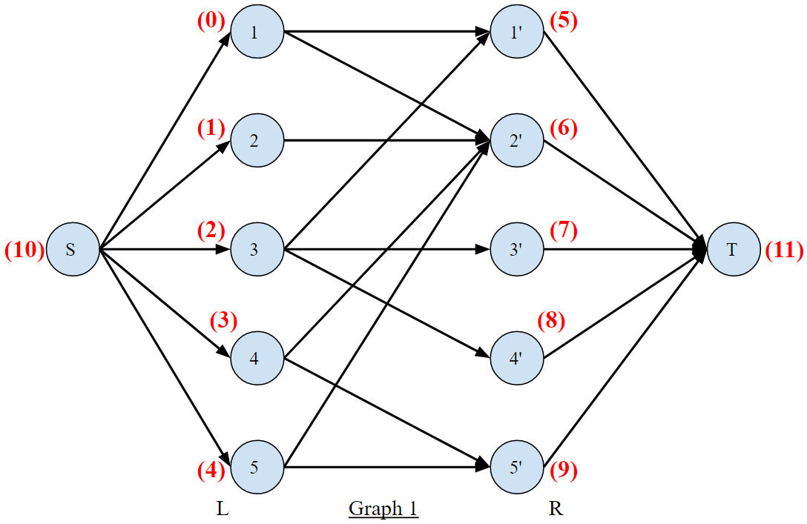
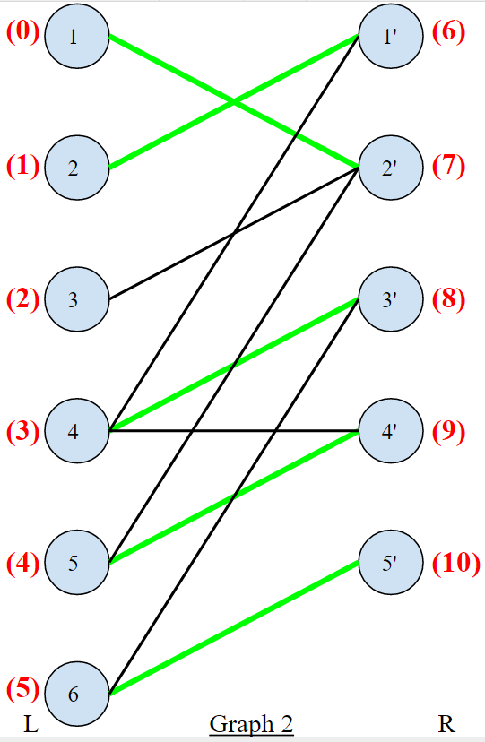

# Bipartite Matching Algorithm
Extension of a **Ford Fulkerson** max flow problem using **depth first search**

## Problem Statement
Given a bipartite graph, find the maximum matching between left & right halves. Each node in the **Left half `L`** mapped to at most 1 node in `R`. Similarly, each node in the **Right Half `R`** is mapped to at most 1 node in `L`  
**Goal:** maximuze the number of matchings

## Algorithm
Convert to a Max Flow / Min Cut problem by making a **directed graph**:
1. Make all edges from `L` to `R` directed with capacity 1
2. Connect a **Source `S`** to every vertex in the left half
3. Connect a **Sink `T`** to every vertext in the right half
4. Use Ford-Fulkerson algorithm to find the max flow
  
## Usage (setting things up in `main()`)
- Graph is represented as an **edge list**
- `vertexCount` must be an accurate number of nodes in the graph
- `getStringVertexIdFromArrayIndex` allows conversion between the array indexes used by the actual algorithm & the human-readable names of the vertices. These are sequential with `"S"` and `"T"` being added at the end
- `S` & `T` are added to the end of the list of vertices with **`S` getting array index `vertexCount`** and **`T` getting array index `vertexCount+1`**
- `int[] leftHalfVertices` contains the array indexes of the vertices in the left part of the bipartite graph
- Similarly, `int[] rightHalfVertices` contains the vertices in the right half
- **These must be *consecitive integers* with the 1st number in `rightHalfVertices` being 1 greater than the last number in `leftHalfVertices`**
- Use `addEdge()` method on `BipartiteMatching` class to add new edges
- Run `connectSourceToLeftHalf()` to modify the graph & add the source, then `connectSinkToRightHalf()` to connect the sink
- Run `fordFulkersonMaxFlow(source, sink)` to find the maximum matching

### Starting Graphs
  &nbsp;&nbsp;&nbsp;&nbsp;&nbsp;&nbsp;  

### Relabeled Graphs
The code uses array indexes instead of nice human-readable Vertex names. Red numbers represent **array indexes**
  &nbsp;&nbsp;&nbsp;&nbsp;&nbsp;&nbsp;&nbsp;  

### Directed Graphs With Source & Sink Added
  &nbsp;&nbsp;&nbsp;&nbsp;&nbsp;&nbsp;&nbsp;  

### Maximum Matching Solutions
These are not unique, but these are what the program finds  
  &nbsp;&nbsp;&nbsp;&nbsp;&nbsp;&nbsp;&nbsp;  
